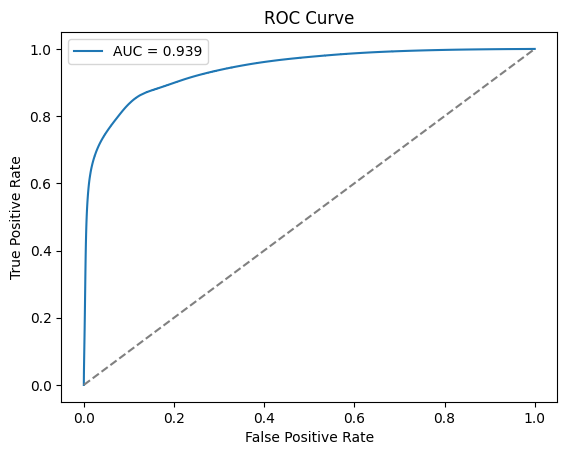
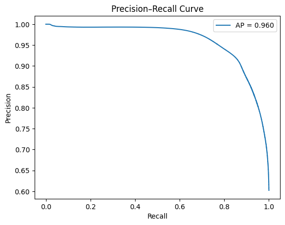

# INFOSYS-INTERNSHIP-OIL_SPILL_DETECTION
PROJECT SUBMISSION

# 🛢️ Oil Spill Detection Using U-Net

A deep learning application that detects marine oil spills from SAR satellite imagery using a U-Net segmentation model — deployed with a user-friendly Streamlit web interface and MongoDB backend for secure image logging and user activity storage.

---

## 📌 Table of Contents
- [Overview](#overview)
- [Key Features](#key-features)
- [Dataset](#dataset)
- [Data Preprocessing & Augmentation](#data-preprocessing--augmentation)
- [Model Architecture](#model-architecture)
- [Installation](#installation)
- [MongoDB Setup](#mongodb-setup)
- [Run Streamlit App](#run-streamlit-app)
- [Training](#training)
- [Inference](#inference)
- [Evaluation & Visualizations](#evaluation--visualizations)
- [Project Structure](#project-structure)
- [Results](#results)
- [Future Enhancements](#future-enhancements)
- [Author](#author)


---

## 🔍 Overview
Oil spill disasters severely damage marine ecosystems.  
This project provides:

✅ AI-powered pixel-accurate oil spill detection  
✅ Real-time user interaction via Streamlit  
✅ MongoDB storage for uploaded inputs & predictions

---

## 🚀 Key Features
✔ U-Net segmentation trained on SAR image dataset  
✔ Full model lifecycle: training → evaluation → deployment  
✔ MongoDB logging for image uploads + results  
✔ Threshold-based segmentation tuning  
✔ Accuracy & confidence score display  
✔ Visual overlays + downloadable predictions  

---

## 📂 Dataset

This project uses the **Oil Spill Detection via Aerial Drone Imagery** dataset published on Zenodo.

🔗 Dataset Link: https://zenodo.org/records/10555314

| Property | Description |
|---------|-------------|
| Source | Aerial drone images captured over sea-surface |
| Classes | Oil Spill (1) vs Clean Water (0) |
| Annotation Format | Binary segmentation masks |
| Image Format | RGB images (.jpg/.png) |
| Mask Format | Single-channel masks (0/255) |
| Usage | Semantic segmentation for oil spill localization |


Splits:
Train 70% | Val 20% | Test 10%

---

## 🧹 Data Preprocessing & Augmentation

To ensure the model learns robust oil spill features and generalizes well in real-world conditions, several preprocessing + augmentation operations are applied:

### ✅ Preprocessing

| Step                     | Description                                                            |
| ------------------------ | ---------------------------------------------------------------------- |
| **Resizing**             | All images + masks resized to `(256 × 256)` for uniform batch training |
| **Normalization**        | Pixel values scaled from `0-255 → 0-1`                                 |
| **Mask binarization**    | Ground-truth masks converted to binary (0: water, 1: oil spill)        |
| **Train/Val/Test split** | Dataset divided using 70/20/10 ratio                                   |

> These operations ensure stable training and proper pixel-wise segmentation output.

---

### 🎯 Data Augmentation

Oil spills in water occur in varied environments, lighting, and angles — so augmentations improve robustness and reduce overfitting.

| Augmentation                                     | Why it helps                                           |
| ------------------------------------------------ | ------------------------------------------------------ |
| **Horizontal & Vertical Flip**                   | Oil pattern symmetry — improves spatial generalization |
| **Random Rotations (0°–270°)**                   | Drone view angle changes                               |
| **Random Zoom & Cropping**                       | Simulates different altitude & spill scale variations  |
| **Brightness, Contrast, Saturation Adjustments** | Different lighting + water reflections                 |
| **Small Random Noise** *(optional)*              | Makes model resilient to camera noise                  |

Used safely with segmentation masks (masks are transformed identically ✅).

---

### 🔧 Augmentation Pipeline

```python
def augment_image_mask(image, mask):
    image = tf.cast(image, tf.float32) / 255.0
    mask  = tf.cast(mask > 0, tf.float32)

    # Random flip
    if tf.random.uniform(()) > 0.5:
        image = tf.image.flip_left_right(image)
        mask  = tf.image.flip_left_right(mask)
    if tf.random.uniform(()) > 0.5:
        image = tf.image.flip_up_down(image)
        mask  = tf.image.flip_up_down(mask)

    # Random rotation
    k = tf.random.uniform([], minval=0, maxval=4, dtype=tf.int32)
    image = tf.image.rot90(image, k)
    mask  = tf.image.rot90(mask, k)

    # Random zoom
    if tf.random.uniform(()) > 0.5:
        scale = tf.random.uniform([], 0.85, 1.0)
        h, w, _ = image.shape
        ch, cw = int(scale * h), int(scale * w)
        image = tf.image.resize_with_crop_or_pad(image, ch, cw)
        mask  = tf.image.resize_with_crop_or_pad(mask, ch, cw)
        image = tf.image.resize(image, (256, 256))
        mask  = tf.image.resize(mask, (256, 256), method="nearest")

    # Color jitter (image only)
    image = tf.image.random_brightness(image, 0.05)
    image = tf.image.random_contrast(image, 0.9, 1.1)
    image = tf.image.random_saturation(image, 0.9, 1.1)

    return image, mask
```

---

### 📌 Final Train Pipeline

```python
train_ds = train_ds.map(lambda x, y: augment_image_mask(x, y))
train_ds = train_ds.batch(BATCH_SIZE).prefetch(tf.data.AUTOTUNE)
```

✅ Ensures GPU utilization is efficient <br>
✅ Prevents model memorization <br>
✅ Boosts segmentation performance <br>

---


## 🧠 Model Architecture — U-Net
Designed for biomedical & geospatial segmentation:

| Component | Layers |
|----------|--------|
| Encoder | 4 Conv + MaxPool blocks |
| Bottleneck | Deepest feature extractor |
| Decoder | 4 UpSampling + Skip connections |
| Output | Sigmoid pixel classifier |

Why U-Net?  
✅ Retains fine spill boundaries  
✅ Efficient for small datasets  
✅ Pixel-wise output required for area mapping

---

## ⚙️ Installation

Install requirements:

```bash
pip install -r requirements.txt
```

✅ Works on Windows / Linux / macOS <br>
✅ Supported: Python 3.9+ , TensorFlow 2.15+

---

## 🍃 MongoDB Setup

1️⃣ Create MongoDB Atlas cluster<br>
2️⃣ Get connection string:

```
mongodb+srv://<user>:<password>@<cluster-name>.mongodb.net/
```

3️⃣ Save credentials to:

```
oil_spill_app/.streamlit/secrets.toml
```

Example:

```toml
MONGO_URI = "your_mongo_db_connection_string"
DB_NAME = "oil_spill_db"
COLLECTION_NAME = "predictions"
```

🔐 Streamlit automatically secures this file — do *not* commit it.

---

## 🎛 Run Streamlit App

From root folder run:

```bash
streamlit run oil_spill_app/app.py
```

Web UI Features:<br>
✅ Upload SAR image<br>
✅ Oil region segmentation mask display<br>
✅ Colormap overlay visualization <br>
✅ Confidence stats + IoU prediction <br> 
✅ Save to MongoDB


---

## 📊 Evaluation & Visualizations

✅ ROC curve<br>
<br>
✅ Precision Recall curve<br>
<br>
✅ Dice & IoU improvements<br>
<br>
✅ Threshold optimization<br>
<br>
✅ Confidence Map<br>
<br>
✅ Pixel Distribution<br>
<br>


📊 Example Output:


---

## 🧪 Training

Best model saved at:

```
checkpoints/seg_model_best.keras
```

---

## 🤖 Inference

```bash
python src/inference.py --image path_to_image.png
```

Output:
✅ Binary spill mask
✅ Overlay image
✅ Pixel area estimation

---

## 📁 Project Structure

```bash
Oil Spill Detection/
│
├─ data/
├─ src/
│  ├─ OilSpillDetection.ipynb
│
├─ oil_spill_app/
│  ├─ app.py               # Streamlit UI code
│  ├─ templates/           # CSS, assets (optional)
│  ├─ utils/               # Helper functions: colormap, db handlers
│  └─ .streamlit/
│     └─ secrets.toml      # MongoDB credentials
│
├─ checkpoints/
│  └─ seg_model_best.keras
│
│
└─ README.md
```

---

## ✅ Results Summary

| Metric            | Score  |
| ----------------- | ------ |
| Dice              | ~0.90  |
| IoU               | ~0.86  |
| Accuracy          | ~90%   |
| Boundary Accuracy | High ✅ |
| False Positives   | Low ✅  |

---

## 🔮 Future Enhancements

| Feature                                      | Benefit                  |
| -------------------------------------------- | ------------------------ |
| Attention-U-Net                              | More precise detection   |
| Real-time satellite integration API          | Automatic early warnings |
| Deploy to cloud (GCP/Heroku/Streamlit Cloud) | Public usage             |
| Multi-class segmentation                     | Spill severity + type    |
| Drift monitoring                             | Continuous training      |

---

## 👩‍💻 Author

**Sanskruti Patil**
Deep Learning & Environmental Monitoring Enthusiast 🌊🌍

📬 Reach out for collaborations!

⭐ If this project helped you — please star the repo on GitHub!
