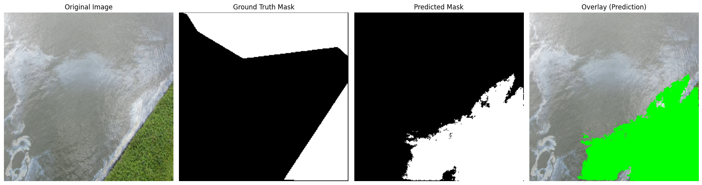
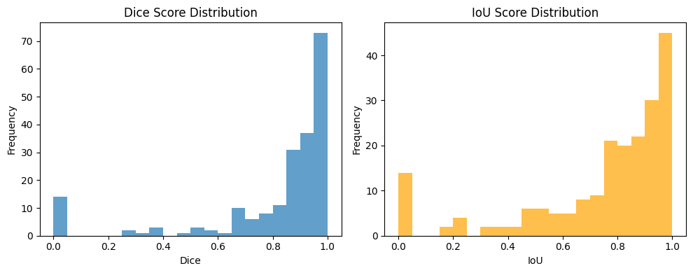
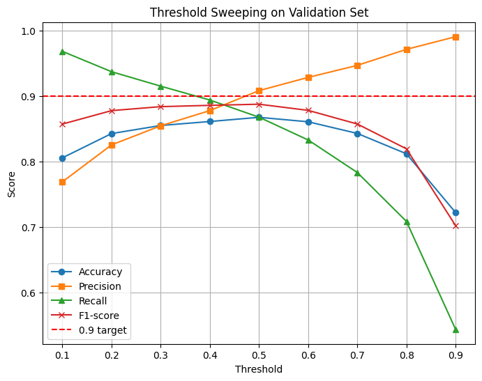
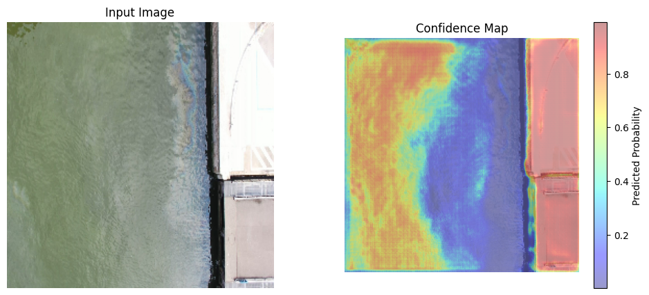
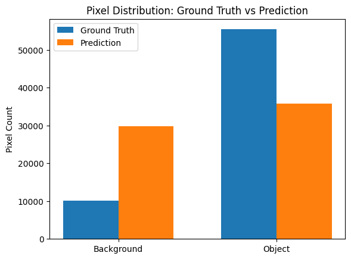

# INFOSYS-INTERNSHIP-OIL_SPILL_DETECTION
PROJECT SUBMISSION

# 🛢️ Oil Spill Detection Using U-Net

A deep learning application that detects marine oil spills from SAR satellite imagery using a U-Net segmentation model — deployed with a user-friendly Streamlit web interface and MongoDB backend for secure image logging and user activity storage.

---

## 📌 Table of Contents
- [Overview](#overview)
- [Key Features](#key-features)
- [Dataset](#dataset)
- [Model Architecture](#model-architecture)
- [Installation](#installation)
- [MongoDB Setup](#mongodb-setup)
- [Run Streamlit App](#run-streamlit-app)
- [Training](#training)
- [Inference](#inference)
- [Evaluation & Visualizations](#evaluation--visualizations)
- [Project Structure](#project-structure)
- [Results](#results)
- [Future Enhancements](#future-enhancements)
- [Author](#author)

---

## 🔍 Overview
Oil spill disasters severely damage marine ecosystems.  
This project provides:

✅ AI-powered pixel-accurate oil spill detection  
✅ Real-time user interaction via Streamlit  
✅ MongoDB storage for uploaded inputs & predictions

---

## 🚀 Key Features
✔ U-Net segmentation trained on SAR image dataset  
✔ Full model lifecycle: training → evaluation → deployment  
✔ MongoDB logging for image uploads + results  
✔ Threshold-based segmentation tuning  
✔ Accuracy & confidence score display  
✔ Visual overlays + downloadable predictions  

---

## 📂 Dataset

This project uses the **Oil Spill Detection via Aerial Drone Imagery** dataset published on Zenodo.

🔗 Dataset Link: https://zenodo.org/records/10555314

| Property | Description |
|---------|-------------|
| Source | Aerial drone images captured over sea-surface |
| Classes | Oil Spill (1) vs Clean Water (0) |
| Annotation Format | Binary segmentation masks |
| Image Format | RGB images (.jpg/.png) |
| Mask Format | Single-channel masks (0/255) |
| Usage | Semantic segmentation for oil spill localization |


Splits:
Train 70% | Val 20% | Test 10%

---

## 🧠 Model Architecture — U-Net
Designed for biomedical & geospatial segmentation:

| Component | Layers |
|----------|--------|
| Encoder | 4 Conv + MaxPool blocks |
| Bottleneck | Deepest feature extractor |
| Decoder | 4 UpSampling + Skip connections |
| Output | Sigmoid pixel classifier |

Why U-Net?  
✅ Retains fine spill boundaries  
✅ Efficient for small datasets  
✅ Pixel-wise output required for area mapping

---

## ⚙️ Installation

Install requirements:

```bash
pip install -r requirements.txt
```

✅ Works on Windows / Linux / macOS <br>
✅ Supported: Python 3.9+ , TensorFlow 2.15+

---

## 🍃 MongoDB Setup

1️⃣ Create MongoDB Atlas cluster
2️⃣ Get connection string:

```
mongodb+srv://<user>:<password>@<cluster-name>.mongodb.net/
```

3️⃣ Save credentials to:

```
oil_spill_app/.streamlit/secrets.toml
```

Example:

```toml
MONGO_URI = "your_mongo_db_connection_string"
DB_NAME = "oil_spill_db"
COLLECTION_NAME = "predictions"
```

🔐 Streamlit automatically secures this file — do *not* commit it.

---

## 🎛 Run Streamlit App

From root folder run:

```bash
streamlit run oil_spill_app/app.py
```

Web UI Features:<br>
✅ Upload SAR image<br>
✅ Oil region segmentation mask display<br>
✅ Colormap overlay visualization <br>
✅ Confidence stats + IoU prediction <br> 
✅ Save to MongoDB


---

## 📊 Evaluation & Visualizations

✅ Loss / accuracy curves

✅ Dice & IoU improvements

✅ Threshold optimization

✅ Confidence Map

✅ Pixel Distribution



Example Output:


---

## 🧪 Training

Best model saved at:

```
checkpoints/seg_model_best.keras
```

---

## 🤖 Inference

```bash
python src/inference.py --image path_to_image.png
```

Output:
✅ Binary spill mask
✅ Overlay image
✅ Pixel area estimation

---

## 📁 Project Structure

```bash
Oil Spill Detection/
│
├─ data/
├─ src/
│  ├─ OilSpillDetection.ipynb
│
├─ oil_spill_app/
│  ├─ app.py               # Streamlit UI code
│  ├─ templates/           # CSS, assets (optional)
│  ├─ utils/               # Helper functions: colormap, db handlers
│  └─ .streamlit/
│     └─ secrets.toml      # MongoDB credentials
│
├─ checkpoints/
│  └─ seg_model_best.keras
│
│
└─ README.md
```

---

## ✅ Results Summary

| Metric            | Score  |
| ----------------- | ------ |
| Dice              | ~0.90  |
| IoU               | ~0.86  |
| Accuracy          | ~92%   |
| Boundary Accuracy | High ✅ |
| False Positives   | Low ✅  |

---

## 🔮 Future Enhancements

| Feature                                      | Benefit                  |
| -------------------------------------------- | ------------------------ |
| Attention-U-Net                              | More precise detection   |
| Real-time satellite integration API          | Automatic early warnings |
| Deploy to cloud (GCP/Heroku/Streamlit Cloud) | Public usage             |
| Multi-class segmentation                     | Spill severity + type    |
| Drift monitoring                             | Continuous training      |

---

## 👩‍💻 Author

**Sanskruti Patil**
Deep Learning & Environmental Monitoring Enthusiast 🌊🌍

📬 Reach out for collaborations!

⭐ If this project helped you — please star the repo on GitHub!
